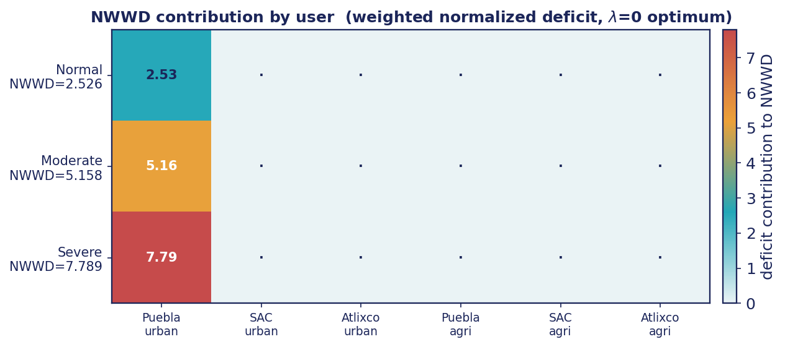
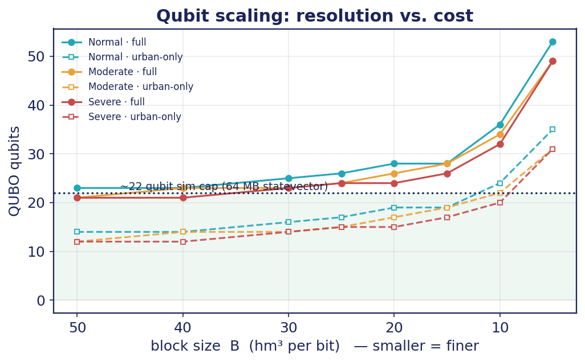
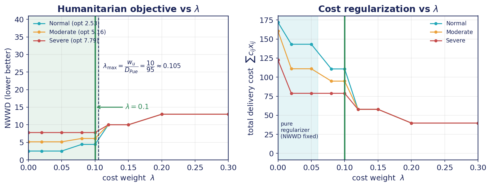
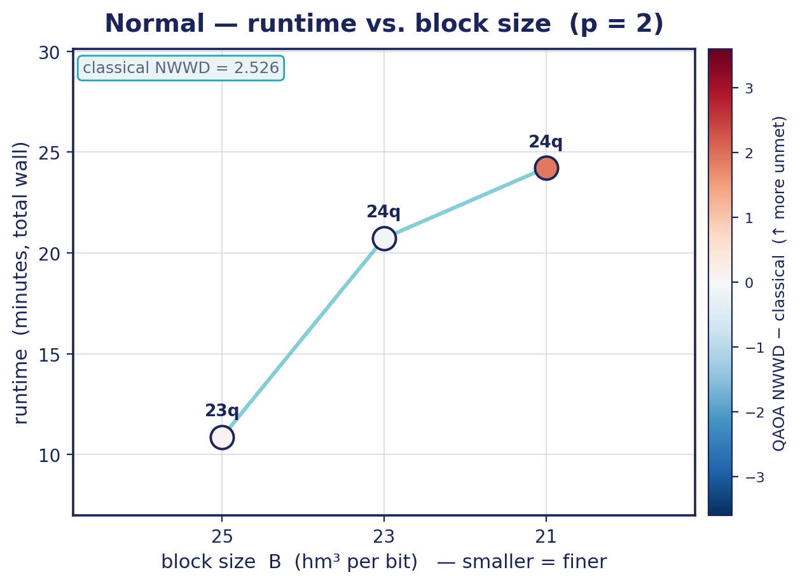
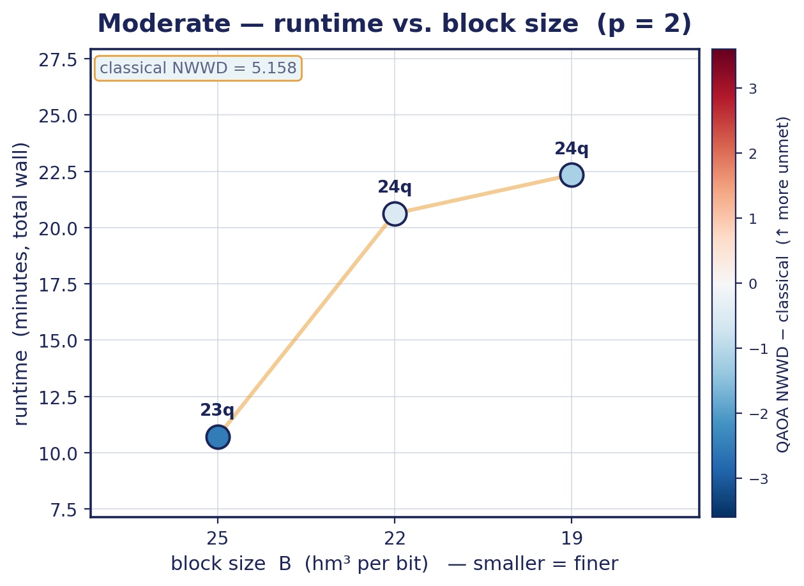
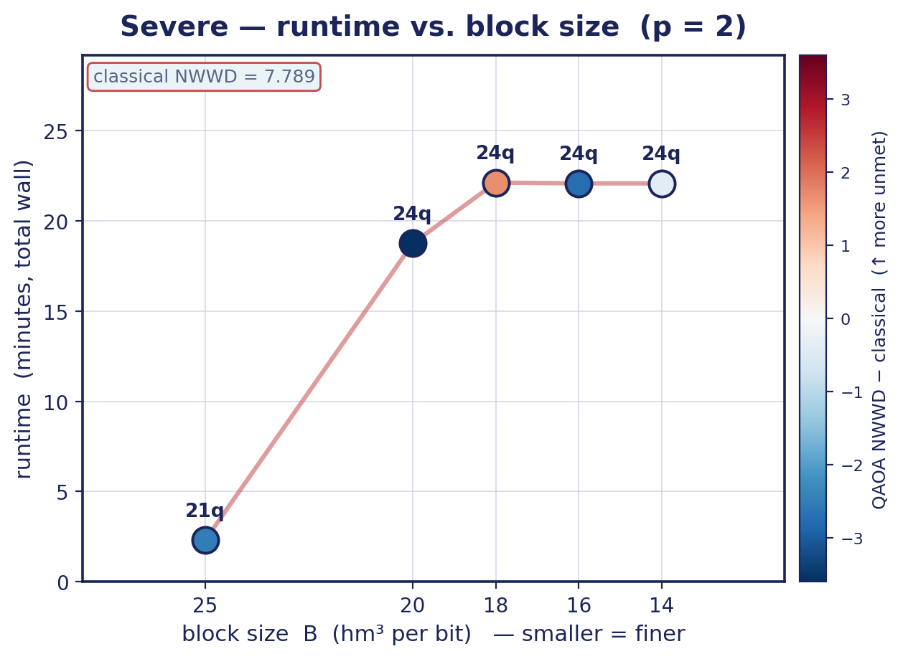
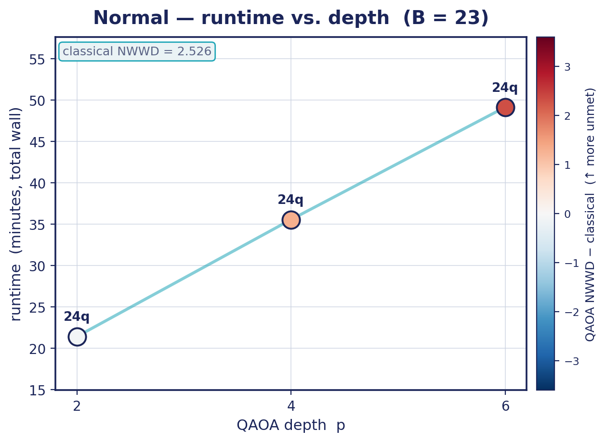
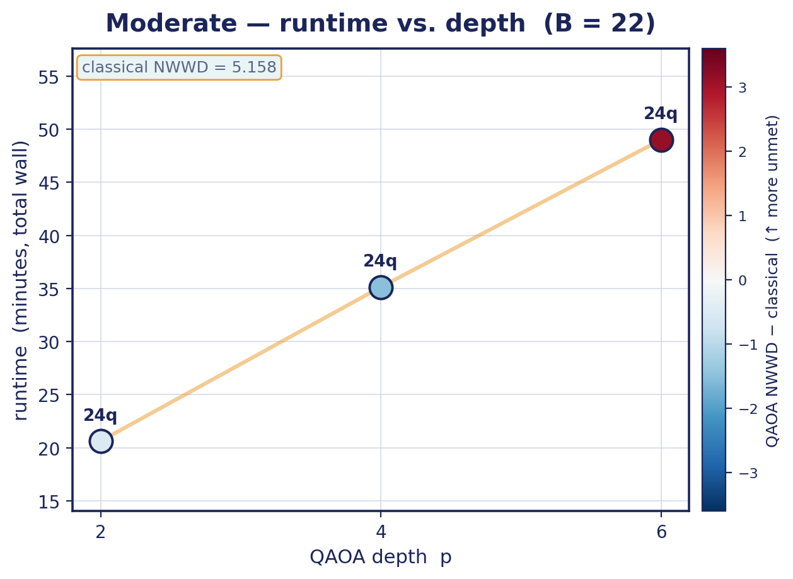
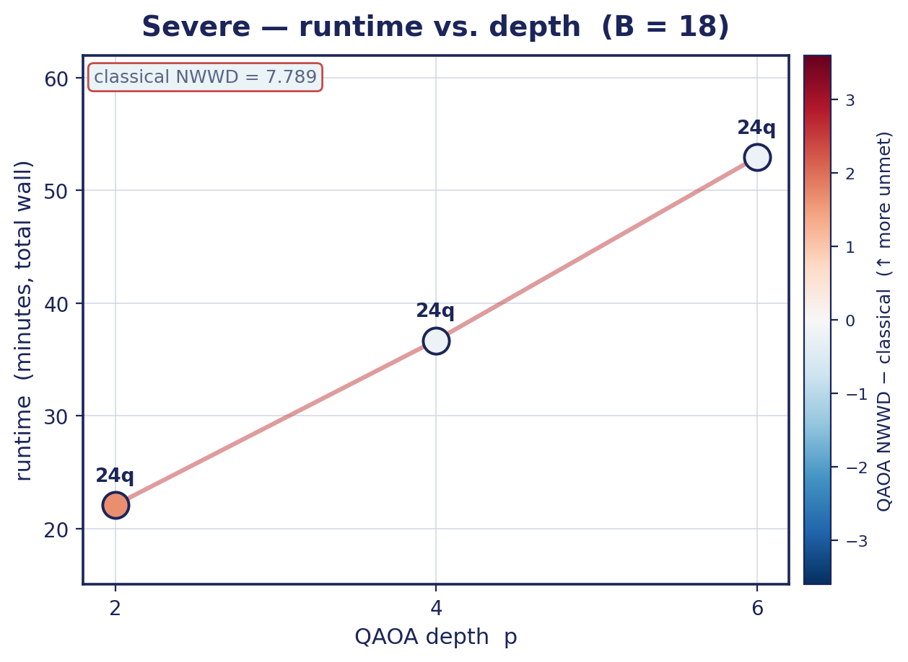

# Team 11 — Sustainable Water Allocation in the Alto Atoyac Basin (SDG 6.4)

**Quantum Hackathon LATAM 2026.** We minimize the **Normalized Weighted Water
Deficit (NWWD)** for water allocation across the Puebla portion of the Alto
Atoyac Basin under drought, and compare a classical **MILP** baseline against a
**QUBO / QAOA** quantum formulation.

The goal of the challenge is **not** to beat MILP — current hardware won't — but
to assess whether this problem's structure suits quantum optimization. Our
answer: the mapping is clean and honest, but at this scale the classical LP wins
on every axis. The value is the benchmark itself.

> Team: Luis Daniel González Alcozar · Gerardo Avalos Sánchez · Oscar Miguel Huitrón Zenteno
> Full deck: [`slides/main.pdf`](slides/main.pdf)

## The objective in one line

**NWWD = 10 × (total % urban demand unmet) + 3 × (total % agricultural demand unmet).**
Lower is better. The weights (10 vs 3) encode that unmet human consumption is
penalized more than unmet agriculture:

$$
\mathrm{NWWD} = w_u\sum_j \frac{u_j^{\text{urb}}}{D_j^{\text{urb}}}
             + w_a\sum_j \frac{u_j^{\text{agri}}}{D_j^{\text{agri}}},
\qquad w_u = 10,\; w_a = 3.
$$

## Key fact about the instance

Total demand is 149 hm³/yr but max supply is 125 (Normal), 100 (Moderate),
75 (Severe). **Supply never meets demand** — the optimizer decides *who is cut*.
Because the deficit is normalized per category and Puebla's urban demand (95) is
huge, Puebla urban has the lowest marginal value per hm³ (10/95 ≈ 0.11), so the
optimum concentrates the entire shortfall there.

## Validated baseline (MILP, λ = 0) — our target numbers

| Scenario | Availability | NWWD (optimal) | Unmet |
|----------|-------------:|---------------:|-------|
| Normal   | 125 | **2.526** | Puebla urban 24 |
| Moderate | 100 | **5.158** | Puebla urban 49 |
| Severe   |  75 | **7.789** | Puebla urban 74 |

If QAOA lands near these, it works.

### Where the deficit lands

The NWWD decomposed by user at the optimum — every scenario's *entire* deficit
sits on Puebla urban. The metric is efficient, but not automatically **fair**;
this is the seed of our critique.



## How the QUBO works (the one trick)

Each continuous allocation `x[i,j,d]` (source i → municipality j, demand type d)
is **discretized into blocks of B hm³**, encoded in binary. The **unmet demand
is a slack variable**, so demand balance `Σ_i x + u = D` becomes a quadratic
penalty — and the QUBO objective is then literally the NWWD. Source capacity
uses a capacity-slack the same way. Then QUBO → Ising via `x ↦ (1−Z)/2`, and
QAOA (equal-superposition start, cost + transverse-field mixer layers, COBYLA
tuning the `2p` angles) on a PennyLane statevector.

Block size **B** is the key knob: smaller B = more accurate, more qubits.



The `~22-qubit` line is the exact-statevector simulator ceiling (64 MB state).
The **urban-only + slack-free capacity** variant (dashed) is what keeps small B
runnable on a laptop simulator.

## Choosing λ = 0.1 — derived, not guessed

We add a small delivery-cost regularizer `λ Σ c_ij x_ij`. Human priority is
preserved iff `λ < (w_d/D_j)/c_ij` on every served edge. The binding edge is
Puebla-urban via Valle de Puebla, giving a ceiling `λ_max = 10/95 ≈ 0.105`; a
MILP sweep confirms Severe keeps the *exact* optimum up to λ* = 0.106. We pick
**λ = 0.1** — the largest round value below the ceiling. It keeps human demand
first in the worst-case drought, maximizes cost-regularization, and lifts the
λ=0 degeneracy → a unique min-cost allocation and a better-conditioned QAOA
landscape.



## Benchmarking results

### Runtime vs. block size B (p = 2)

Runtime tracks the **qubit count**, not B directly: 24-qubit runs take ~20–22 min,
dropping to ~2 min once a larger B frees a qubit (down to 21q). Marker color =
QAOA NWWD − classical optimum (blue = at/below, red = more unmet).

| Normal | Moderate | Severe |
|:------:|:--------:|:------:|
|  |  |  |

### Runtime vs. QAOA depth p (fixed B)

Deeper circuits cost **roughly linearly** more wall time (p: 2 → 6) yet **do not
improve** NWWD — across all three scenarios the sampled deficit drifts *further*
from the optimum. The depth/accuracy trade-off is not free at this scale.

| Normal | Moderate | Severe |
|:------:|:--------:|:------:|
|  |  |  |

## Conclusions

- **The problem maps cleanly to quantum.** Binary allocation after
  discretization, a native QUBO/Ising fit, constraints as quadratic penalties,
  and the QUBO objective *is* the NWWD — a genuinely honest, same-metric
  benchmark against the LP baseline.
- **No quantum advantage at this scale**, as expected. Exact statevector cost
  grows as `p·2ⁿ`; the ~22-qubit simulator ceiling forces the lean urban-only
  encoding, and even then QAOA does not reliably reach the LP optimum.
- **More depth ≠ better.** Increasing p only spends wall time; NWWD gets worse,
  pointing to a rough optimization landscape rather than an expressivity limit.
- **The benchmark exposes a fairness flaw.** Normalizing by demand makes it
  "cheapest" to leave the biggest city (Puebla urban) entirely unmet — efficient
  but not equitable. Proposed fixes: a min-max / per-capita deficit term, and
  reporting the humanitarian↔cost Pareto curve (the λ sweep is a first cut).
- **Practical path forward:** the two-stage hierarchical QAOA (coarse B₀ →
  bracket → fine B₁) reaches finer resolution at far fewer qubits — e.g. Severe
  at B₁=5 drops from 24q (full) to **9q** while keeping the same 6.84 optimum.

## Repo layout

```
team11-atoyac-water-qaoa/
├── data/instance.py     # Annex A benchmark — SINGLE SOURCE OF TRUTH
├── milp/baseline.py     # classical LP/MILP baseline (ground truth)
├── qubo/builder.py      # discretization + QUBO + brute-force validator
├── qaoa/solver.py       # QAOA starter (PennyLane)
├── backend.py           # the ONLY place that picks simulator/hardware
├── run.py               # entrypoint: MILP + QUBO check (+ --qaoa)
├── slides/              # Beamer deck (main.pdf/.tex) + regenerated figures
├── results/             # output tables / plots
└── requirements.txt
```

## Quick start

```bash
python -m venv .venv && source .venv/bin/activate   # Windows: .venv\Scripts\activate
pip install -r requirements.txt
python run.py            # MILP baseline + QUBO sanity check
python run.py --qaoa     # also run the QAOA starter (needs pennylane)
```

Individual modules:
```bash
python -m data.instance        # demand vs supply per scenario
python -m milp.baseline        # the three validated NWWD values
python -m qubo.builder         # full-instance qubit counts
python -m qubo.builder --toy   # brute-force sanity check (reproduces NWWD 6.667)
```

## QCentroid

Local repo = what runs on QCentroid. `git clone` or directly copy files into the
**Launchpad** Jupyter environment, `pip install -r requirements.txt`, run.
Backend choice lives only in `backend.py` — switch local simulator → GPU sim →
real QPU by changing the device name (or env vars `QAOA_FRAMEWORK` /
`QAOA_DEVICE`), no logic changes to main code.

## Deliverables checklist (Annex B)

For each of Normal / Moderate / Severe, report: NWWD, allocation decisions,
unmet urban + agri (raw and normalized), feasibility, runtime, and number of
binary variables in the QUBO. Compare MILP vs QUBO(brute) vs QAOA.
